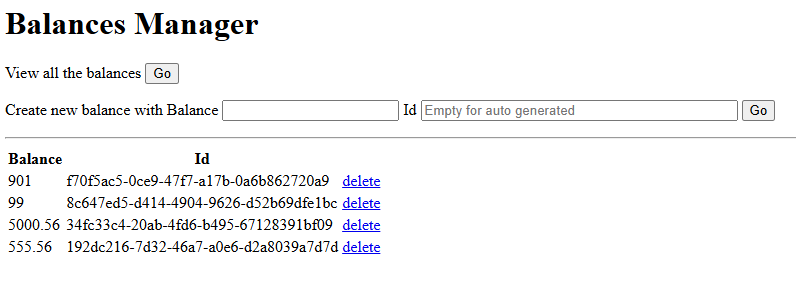

# FullCycle - Microservice Architecture (Full Cycle 3.0 Course)

<div align="center">
    
    
    
    
</div>

## Balances Challenge

-   [Source](wallet_core/balances/)
    -   [Dockerfile](wallet_core/balances/Dockerfile)
    -   [client.http](wallet_core/balances/client.http)
    -   [Main.kt](wallet_core/balances/src/main/kotlin/Main.kt)
-   [Docker Compose](wallet_core/docker-compose.yaml)

### Database Init

-   [01-wallet.sql](wallet_core/.docker/initdb/01-wallet.sql)
-   [02-balances.sql](wallet_core/.docker/initdb/02-balances.sql)

### HTML Balances Manager

-   [/static](wallet_core/balances/src/main/resources/static/index.html)
    - 

### API Endpoints

-   [GET /balances]()
    -   Result:
        -   ```json
            [
                {
                    "balance": 901,
                    "id": "f70f5ac5-0ce9-47f7-a17b-0a6b862720a9",
                    "updatedAt": "2025-07-18T22:03:12"
                },
                {
                    "balance": 99,
                    "id": "8c647ed5-d414-4904-9626-d52b69dfe1bc",
                    "updatedAt": "2025-07-18T22:03:12"
                }
            ]
            ```
-   [GET /balances/{account_id}](wallet_core/balances/src/main/kotlin/api/Balances.kt)
    -   Result:
        -   ```json
            {
                "balance": 901,
                "id": "f70f5ac5-0ce9-47f7-a17b-0a6b862720a9",
                "updatedAt": "2025-07-18T22:03:12"
            }
            ```
-   [POST /balances}](wallet_core/balances/src/main/kotlin/api/Balances.kt)
    -   Input:
        -   ```json
            {
                "balance": "5000.56"
            }
            ```
    -   Result:
        -   ```json
            {
                "balance": 5000.56,
                "id": "6b4a7738-c32e-49a8-8719-4318626575a2",
                "updatedAt": "2025-07-18T22:16:17"
            }
            ```
-   [DELETE /balances/{account_id}}](wallet_core/balances/src/main/kotlin/api/Balances.kt)
